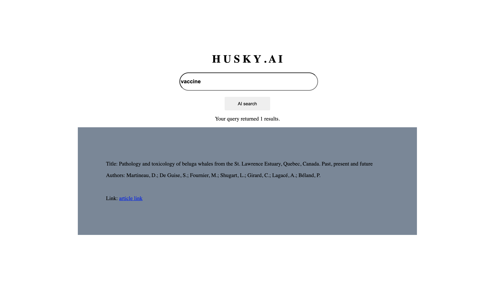

# Title: Optimized Search Engine utilizing Categorization, Hidden Pattern Mining and Information Retrieval

## Authors: Srikanth Babu Mandru

## Summary:

   In the present world, the researchers have been publishing their ideas and ways to deal with the scientific problems. It is, often, difficult to keep up with these numerous articles being published daily. This project mainly focus on solving the problem of identifying related articles from the groups (categories) of articles, and also understand the context for each those groups, which helps us to categorize the articles and focus more on the those articles that are of high interest during the search for related articles with the user provided search term. This kind of search engine benefits hugely in terms of speed and performance, while searching from the large data, using Machine learning model. Further, this project also aims at building a web application to provide user with better User Interface for searching the documents and give access to information regarding the relevant articles.

## About data:

For this project, dataset has been taken from 'Kaggle' [(link)](https://www.kaggle.com/allen-institute-for-ai/CORD-19-research-challenge). This dataset was created by the Allen Institute for AI in partnership with the Chan Zuckerberg Initiative, Georgetown University’s Center for Security and Emerging Technology, Microsoft Research, IBM, and the National Library of Medicine - National Institutes of Health, in coordination with The White House Office of Science and Technology Policy.

## Methods and Approach: 
  
  As the data comes in the form of text, initially, the text will be parsed and convert each document's text into machine understandable way for machine learning tasks using 'Term Frequency–inverse Document Frequency (TF-IDF)' vectorization method. For categorizing the research papers, we use the clustering techniques from unsupervised machine learning paradigm and group the research articles together so that the close articles stay in same group and different types of articles will be far away from each other. Since, the text data is huge and sparse in nature, dimensionality reduction technique, namely PCA will be applied, before applying the Clustering and other modelling techniques, to shrink the the document representation and remove the unneccesary features from our data. For visualization of the articles, it is difficult to plot with higher dimensional data. Thus, t-Stochastic Neighbour Embedding (t-SNE), a dimensionality reduction technique for visualization of high dimensional data points, will be applied in order to represent the groups of data (labelled clusters) visually.
  
  To find the important words in each article to summarize the context, topic modelling will be performed on each of the groups seperately using the 'LatentDirichletAllocation' (LDA) method. For the implementation part of web application, frontend stack was built using HTML, CSS, JavaScript, whereas, the backend uses the Flask API. To make entire application portable, lightweight and scalable, backend has been "containerized" using Docker compose.

## Results and conclusion:

   For clustering of the articles, Spectral clustering method achieves a silhouette score of "-0.10", which is not high enough but the automated function to choose the number of clusters has been implemented for spectral clustering. This automated way of getting number of clusters is more important, since it was choosen according to the "Eigen Gap" heuristic and resulted in better clustering taking the connectivity of data into consideration. However, we can further improve the scores and performance of clustering model through more data. Also, we have tagged the keywords for each of the article using the Latent Dirichlet Allocation model to know the context from the text.
   
   The web application for users has been implemented, and UI is as shown in the below figure 1. To conclude, with decent results, this projects brings an idea of implementing the search engines using clustering which makes it fast and scalable search as the data grows. In the future, the performance can be improved with modified ML models.
   
 

 Figure 1: Web Application UI 

**Note** - 

   For more details of machine learning, please look at the "Ipython notebook" in this project repository, where I have mentioned the usage and techniques of Machine learning models.

## References: 

1. http://www.mmds.org/

2. https://scikit-learn.org/stable/

3. Kaggle : https://www.kaggle.com/allen-institute-for-ai/CORD-19-research-challenge

## Purpose of this project: 

   - Companies, Eductional institutions and many organizations are being flooded with large corpus of text daily and they need software tools to draw valuable insights from the data and take key decisions to develop business and inturn improve the customer satisfaction towards the company's product. Often, it is case that we need to know the underlying groups or structures in our data, and possibly, get more information about each of them in form of short summaries or make a search on data with really important keywords. This project aims at dealing with similar kind of problem except that we are doing this project with covid-19 research papers.

  - Often, the raw data comes in an unexpected and messy way. We need to tidy up the data and transform it to the form that is useful for the analysis and modelling to make inferences. Mostly, during analysis, we need to find the hidden structure to find the patterns/groups in the data. Finding the patterns gives us more intuition towards solving the problem and reinforces our decisions. Since, the data doesn't have labels, we have to stick with the unsupervised techniques to deal study about the data. This project provides a somewhat comprehensive view on most popular/widely used unsupervised methods and the advantages or drawbacks of each method. The same tools work for other problems as well whether it's structured or unstructured data.
  
